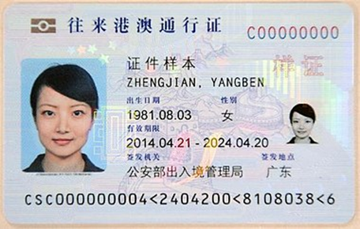
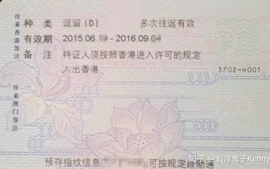
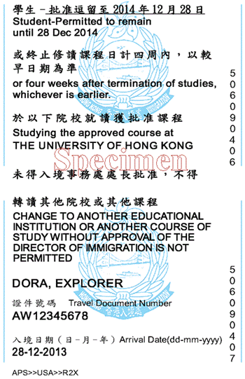

<u>**内地居民身份证（注意有效期）、往来港澳逗留签注（D 签）、港澳通行证 （已办理有效逗留签注）**</u>、护照（办理港澳通行证的时候建议一起办理，非必须）、一寸两寸的免冠照片（入宿或申请各类文件经常用到，多带几张，红底蓝底白底都整一点，电子版也保管好。）

### 必须携带的重要证件、证明及物品

备注：各地公安出入境大厅工作时间不尽相同，可以提前打电话咨询。通常比较保险的时间是周一到周六上午九点至十一点，下午十四点到十六点。

1. **往来港澳通行证**：来港前请注意港澳通行证的剩余有效期是否能够涵盖本科四年的时间 （建议多预留一年的时间以防延毕等特殊情况），如若不能，请及时办理新的港澳通行证，也可以在香港/深圳办新。
2. **内地居民身份证**：在新生入港未获香港居民身份证时，内地居民身份证可用作银行开户，申请香港居民身份证的身份证明材料；在发获香港居民身份证后，内地身份证一般仅用于处理内地相关事宜。
3. **~~进入许可标签**：俗称小粉签，系入境事务处签发的粉色签注。每次出入境都需要出示此凭证，还请务必要妥善保管。办理粉签一般需时四至六周，在签证批出后一般会由学校代为领取，并以特快转递寄给学生本人。考虑到疫情期间新生抵港至少需要隔离一周，且还需预留一周时间用于办理「往来港澳逗留签注」，请在收到 offer 或录取通知书后立即办理申请手续。 进入许可标签需要在指定时间内入境以自动激活（一般为发出之日起三个月内），未在指定时间内激活则该标签将失效，需重新通过学校向入境处申请。该标签日期格式为 DD-MMYYYY。~~
4. **往来港澳逗留签注**：俗称 D 签，为内地同意公民入境香港的多次许可签注。D 签的办理 周期为一周左右，所以当新生收到「进入许可标签」后，应立即向户籍所在地的公安部门出入境管理局申办该签注。如往来港澳通行证为新版（即为一张卡而不是一个小册子），则该签注会喷印在通行证背面。进入许可标签因未激活而失效并不会影响到该签注，因此若粉签过期只需要重新申请粉签即可。
5. **入境标签**：俗称小白条，系新生第一次入境时由香港海关发获的入境纸，上面会表明你的身份、入境时间、有效期及学校等信息。
{: .warning }
> 这里第一次入境的小白条非常重要，关系到你毕业时申请IANG签证以及未来可能的永居申请，请一定要保存好
6. **重要文件原件及复印件**：如录取通知书、户口本复印件及父母身份证复印件（未满十八周岁的同学在办理各类手续时可能需要出示）、成绩证明（用于转学分，仅适用于转学生、国际生新生或其他非一年级新生）。
7. **现金**：建议携带五千左右港币的现金，但需注意有些商铺不收千元面额的纸币。

### 建议携带证件、物品

1. **护照**
2. **一寸及两寸的免冠照片：**入宿或申请各类文件经常用到，建议多准备一些，红底、蓝底、白底都准备一点，电子版也请保管好。
3. **No Objection Letter**：系非本地生在港申请实习、校园兼职、暑期工作时都需要出示的 重要材料，一般会随粉签寄往新生家庭住址，无需专门办理。NOL 普遍分为两种：一，从事校园兼职和暑期工作的 NOL，其有效期与学生的逗留期限一致；二，从事校外实习工作的NOL，其有效期通常为一年。（高考生入学后会有邮件通知，统一前往学校领取；国际生则需要前往移民局办理）

### 证件样本（仅供参考）

